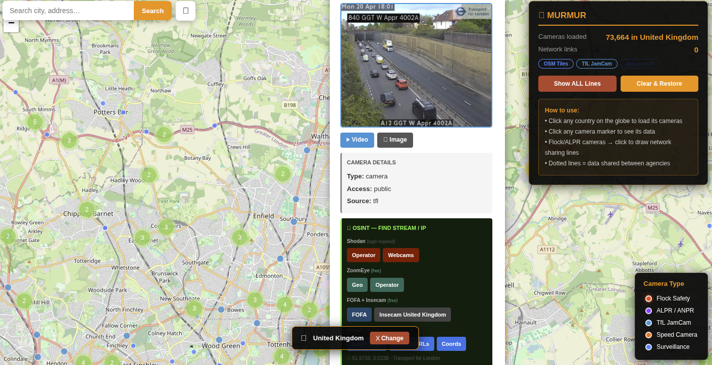

```
 ███╗   ███╗██╗   ██╗██████╗ ███╗   ███╗██╗   ██╗██████╗
 ████╗ ████║██║   ██║██╔══██╗████╗ ████║██║   ██║██╔══██╗
 ██╔████╔██║██║   ██║██████╔╝██╔████╔██║██║   ██║██████╔╝
 ██║╚██╔╝██║██║   ██║██╔══██╗██║╚██╔╝██║██║   ██║██╔══██╗
 ██║ ╚═╝ ██║╚██████╔╝██║  ██║██║ ╚═╝ ██║╚██████╔╝██║  ██║
 ╚═╝     ╚═╝ ╚═════╝ ╚═╝  ╚═╝╚═╝     ╚═╝ ╚═════╝ ╚═╝  ╚═╝
  surveillance network map  —  a tribute to ringmast4r's FLOCK
```

> Interactive OSINT map of 336,708+ surveillance cameras, live feeds, and data-sharing networks worldwide.
> Born from [ringmast4r's FLOCK](https://github.com/ringmast4r/FLOCK) — expanded for a global audience.

**🌐 Live Demo**: https://use3r-riddl3r.github.io/MURMUR/ (I need to set this up :))

<a href="https://hits.sh/github.com/use3r-riddl3r/MURMUR/"></a>



---

## What is MURMUR?

A murmuration is what a flock of starlings does — thousands of individuals moving as one, watching, reacting. That's what surveillance networks do too.

MURMUR started as a fork of [ringmast4r's FLOCK](https://github.com/ringmast4r/FLOCK), a tool he built to map the sprawling Flock Safety camera network across the United States. FLOCK was excellent at what it did — this project takes that foundation and expands it for people outside the US, particularly in the UK and Europe, where Flock Safety cameras are rare but surveillance infrastructure is just as dense.

---

## What Changed From FLOCK

### Country-based loading (crash fix)
The original tool tried to load all 336,708 cameras at once. On most machines this crashed the browser. MURMUR now requires you to select a country first — only that country's tiles load, keeping memory usage manageable and the map responsive.

### UK: TfL JamCam live feeds
When you select the United Kingdom, MURMUR automatically pulls 1,000+ live London traffic camera feeds from the Transport for London API. Each camera popup shows a live thumbnail image, a direct video link, and a still image link — actual footage, not just a pin on a map.

### France: national camera dataset
Selecting France loads the national CCTV dataset from data.gouv.fr alongside the OSM tiles, giving better coverage than OSM alone.

### OSINT toolkit expanded for EU users
FLOCK's original OSINT buttons were built around Shodan geo filters which require a paid plan ($69/month) and are US-centric. MURMUR replaces and expands these with options that work on free accounts and are useful anywhere in the world:

- **Shodan** — operator name search, brand+country search, country webcam search (free tier)
- **ZoomEye** — geo-based webcam search, operator lookup (free)
- **FOFA** — title+country query with base64 encoding (free, EU-friendly)
- **Insecam** — country camera listing (free)
- **Google Dorks** — login page, stream URL enumeration, coordinate search

All queries pre-filled from the camera's own metadata. No API keys needed.

### Code rewrite
The original codebase grew organically and had accumulated some issues (variables re-declared in loops, `btoa()` crashing on European operator names with accented characters, `setTimeout` hacks for map animation timing). The JS was rewritten into 12 clean modules with proper `async/await` throughout, fixing these bugs in the process.

---

## Features

| Feature | Detail |
|---------|--------|
| 🌍 Country-based loading | Click any country — only that region's data loads |
| 📡 TfL JamCam (UK) | 1,000+ live London camera feeds with embedded thumbnails |
| 🇫🇷 France dataset | French national CCTV data via data.gouv.fr |
| 🕸️ Network visualisation | Click a Flock/ALPR camera to draw data-sharing lines to partner agencies |
| 🔍 OSINT per camera | Shodan, ZoomEye, FOFA, Insecam, Google dorks — pre-filled per camera |
| 📊 Agency stats | Vehicle counts, search volumes, data retention periods, full partner lists |
| 🔗 Live feed links | Webcam URLs, stream links, Mapillary/Panoramax imagery, sous-surveillance.net refs |
| 📱 Mobile responsive | Collapsible panel, touch-friendly |

---

## Camera Types

| Colour | Type | Source |
|--------|------|--------|
| 🔴 Red (pulsing) | Flock Safety | DeFlock.me / OpenStreetMap |
| 🟣 Purple | ALPR / ANPR | OpenStreetMap |
| 🔵 Cyan | TfL JamCam | TfL API (live) |
| 🟠 Orange | Speed Camera | OpenStreetMap |
| 🔵 Blue | General Surveillance | OpenStreetMap |
| 🟢 Green | Police / Agency | Derived from network data |

---

## Quick Start

```bash
git clone https://github.com/use3r-riddl3r/MURMUR.git
cd MURMUR
python3 -m http.server 8080
# Open http://localhost:8080
```

### How to Use
1. Click any country on the globe
2. Map flies to that country and loads its cameras
3. **UK** → TfL JamCam live feeds load automatically
4. **France** → data.gouv.fr dataset loads automatically
5. Click any camera marker → popup with data, feeds, OSINT links
6. Click a red (Flock) or purple (ALPR) camera → network sharing lines appear
7. **Show ALL Lines** — draws every known connection
8. **Clear & Restore** — returns to cluster view
9. Legend items are clickable — toggle types on/off

---

## Data Sources

| Source | Data | Coverage |
|--------|------|----------|
| [OpenStreetMap](https://www.openstreetmap.org/) | 336K+ camera locations + metadata | Global |
| [DeFlock.me](https://deflock.me/) | Flock Safety cameras + agency network data | USA |
| [McClatchy Private Eyes](https://github.com/mcclatchy-southeast/private_eyes) | ALPR placement + partnerships | USA |
| [TfL JamCam API](https://api.tfl.gov.uk/Place/Type/JamCam) | 1,000+ live London camera feeds | London, UK |
| [data.gouv.fr](https://www.data.gouv.fr/) | French national camera dataset | France |

---

## Camera Coverage

| Region | Cameras |
|--------|---------|
| Europe | 246,000+ |
| United States | 75,000+ |
| Canada | 28,000+ |
| Asia | 19,000+ |
| Central America | 13,000+ |
| South America | 9,000+ |
| Oceania | 3,000+ |
| Africa | 2,000+ |

---

## File Structure

```
MURMUR/
├── index.html                   # Single-file app — 12 JS modules, no build step
├── data/
│   └── tiles/
│       ├── index.json           # Tile manifest (512 tiles, zoom level 6)
│       └── 6/{x}/{y}.json       # Individual tile data files
├── create_tiles.py              # Tile generation script
├── merge_osm_global.py          # Dataset merge script
├── camera_networks.json         # Network connection data (16MB)
└── favicon.svg
```

> `CAMERAS_WITH_NETWORK_DATA.geojson` (102MB master dataset) kept local only — exceeds GitHub's file limit. The map loads from pre-built tiles.

---

## Technical Details

### JS Module Architecture
```
CONFIG   — constants (API endpoints, colours, cluster config)
STATE    — single mutable store
UTILS    — pure helpers (tile maths, safeBtoa, HTML builders)
LOADER   — spinner UI
POPUP    — popup HTML generation
MARKERS  — marker creation and cluster management
SOURCES  — async data fetching (tiles, TfL, France)
NETWORK  — data-sharing line visualisation
COUNTRY  — country detection, bbox filter, source routing
UI       — DOM updates, layer toggles, source badges
SEARCH   — Nominatim geocoding + geolocation
APP      — entry point and startup sequence
```

### Stack
- [Leaflet.js 1.9.4](https://leafletjs.com/)
- [Leaflet.markercluster 1.5.3](https://github.com/Leaflet/Leaflet.markercluster)
- [OpenStreetMap](https://www.openstreetmap.org/) base tiles
- [Nominatim](https://nominatim.openstreetmap.org/) geocoding
- [TfL Unified API](https://api.tfl.gov.uk/)
- [data.gouv.fr](https://www.data.gouv.fr/)

---

## Credits

Built on the foundation of [ringmast4r's FLOCK](https://github.com/ringmast4r/FLOCK).
All data from publicly available sources. All code MIT licensed.

> *A murmuration is thousands of individuals moving as one.*
> *This map shows the same thing — just in concrete and cable.*
